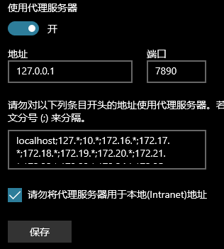
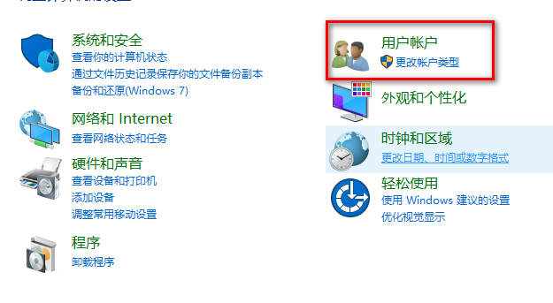
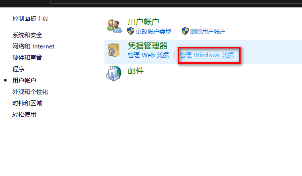
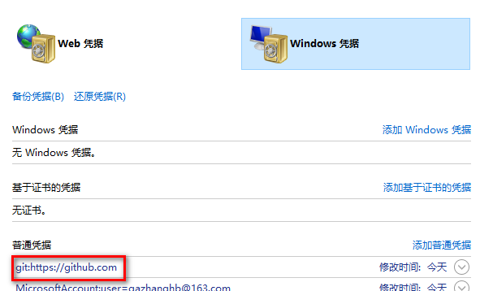

# svn

backup：C:\Users\Public\Documents\VisualSVN Server\Backup\my_backip

repository：https://DESKTOP-9RHGTMC:8443/svn/01_demo/

- 开始写代码前要update一下，提交代码前也要update一下
- svn设置提交忽略文件：
    - 在setting——》general中设置要忽略的文件或文件间夹
    - *.xxx 忽略所有后缀名为.xxx的文件，yyy忽略所有名为yyy的文件夹（也可以是.yyy文件夹）
    - webstorm中：
- svn锁：
    - 作用：文件不能被修改
    - properties中给文件加锁
    - 
- add操作：
    - 给文件加上标签，表示要交给SVN
    - webstorm中选择add to VCS（Version Control System）

- webstorm解决冲突颜色意义：
    - 暗红色：新增的文件
    - 亮红色：有冲突的文件
    - 蓝色：修改了但是还没提交的文件
    - 绿色：文件已经被标识了，表示后边要提交了

# Git

## 常用命令

* mkdir XX：创建一个空目录 XX指目录名

* pwd：显示当前目录的路径

* cat xx：查看xx文件内容

* git init：把当前的目录变成可以管理的git仓库，生成隐藏的.git文件夹

* git add xx：把xx文件添加到暂存区

* git commit -m “xx”：提交文件 -m后面的是注释，必须写！

* git status：查看仓库状态

* git log：查看历史记录

* git reflog：查看历史记录的版本号id

* git diff：比较暂存区与工作区

* git diff --cached：比较版本区与暂存区

* git diff master： 比较版本区与工作区

* git reset --hard HEAD^：往上回退一个版本

* git reset --hard 版本号：回退到指定的commit  id版本

* git reset HEAD：用版本库中的文件去替换暂存区的全部文件

* git checkout -- x.txt：用暂存区指定的文件去替换工作区指定的文件，把xx文件在工作区的修改全部撤销

* git checkout HEAD x.txt：用版本库中的文件去替换暂存区和工作区中的指定文件

* git rm --cached x.txt：从暂存区删除文件，但是工作区中还有

* git rm xx：删除xx文件

* git rm -r xx：删除文件夹

    

* git checkout -b dev：创建dev分支 并切换到dev分支上

* git branch：查看当前所有的分支

* git checkout master：切换回master分支

* git merge dev：在当前分支合并dev分支

* git branch -d dev：删除dev分支

* git branch xxx：创建分支xxx

- git clone https://github.com/xxxxx   从远程库中克隆

* git remote add origin https://github.com/xxxxx/a.git 关联一个远程库
* git push -u（第一次尽量加上-u，以后不用）origin master：把当前master分支推送到远程库
* git remote：查看远程库信息
* git remote -v查看远程库的详细信息
* git pull origin master 将远程库的更新拉取到本地并自动合并
* git pull：拉取所有分支
* git push origin master：git会把master分支推送到远程库对应的分支上

## Attention

- 使用图形界面在git仓库内删除一个文件后，这个删除动作还没有同步到暂存区和版本区，需要add 和 commit来讲工作区的动作同步到暂存区和版本区。

- 使用git rm 文件名 这个命令来删除文件的话，会把这个删除动作同步到暂存区，但是没有同步到版本区

- 当把没有add到暂存区的文件用git命令删除时，会提示没有这个文件（也就是git删除命令会删除暂存和工作区，暂存区没有则报错）。可以使用linux的删除命令删除没有进入暂存区的文件。也就是前边不加git

- 在一个分支上add的文件，如果在其他分支被commit，那么这个文件的最终改动就在commit时的分支

- 一个文件被修改后只能在修改的分支下add，在修改文件未被add前，不能切换分支。
  
    - 但是可以加-f强制切换分支。但是这样会丢失这次修改。
    
- 目前，不使用代理无法打开github网站，那么使用git也无法和github建立连接。即使打开了代理，git和github联系貌似不会自动走代理路线，所以就要给git配置一个代理。

    - https://blog.csdn.net/ALLUN1/article/details/103224324
    - 使用git config --get http.proxy查看git是否添加了代理
    - 使用git config --global http.proxy 127.0.0.1:7890设置代理。这里根据
    - 可在C:\Users\gazha\.gitconfig里边手动删除代理
    - 这样每次使用github就要打开代理了。

- 如果在一个自己的已有文件的仓库中，使用git pull --all来获取远程仓库的内容，目前所在本地仓库的内容不会被远程内容覆盖修改。但是，后边无法再和远程仓库建立联系。因此，要避免这种操作。 即使使用git pull origin master这种一个分支，也不会修改本地分支内容，也无法在后续建立连接。

    - > 所以：
        >
        > - 直接在本地clone远程仓库
        >     - clone仓库时，在任意地方打开gitbash，执行clone，就会在这里边新建一个仓库。
        >     - clone时，默认地址名为origin
        > - 或者将本地有内容的仓库内容push到一个空的远程仓库
      
    - 对于一个有文件的远程仓库和一个有文件的本地仓库，如果想要给两者建立联系，那么应该首先使用git pull origin master从远程拉取文件。但会报错``fatal: refusing to merge unrelated histories``，那么就要再pull后边添加``–allow-unrelated-histories``，即``git pull origin master –allow-unrelated-histories``，然后就可以push了。

- git 每次连一个新的账号密码时，要清掉之前的。步骤如下：

    - 控制面板——》用户账户——》管理windows凭据——》找到github删除
    - 
    - 
    - 

- 如果远程仓库删除了一个文件，而本地有这个文件，当我pull从远程拉取的时候，本地的这个文件也会自动删除。
- 如果本地把一个文件修改了，而远程的对应文件一直没被修改，也就是还是我修改本地文件前的那个样子，那我使用pull从远程拉取文件的时候，不会报错，本地的文件也不会被覆盖，还是我修改后的样子。
- 如果本地把一个文件修改了，而远程的对应文件也被修改了，那我pull的时候就会出现冲突。

## github远程仓库的使用

### 场景1（关联）：本地有仓库，要和远程仓库做关联

- git init

- git add

- git commit -m 'message'

- 在Github上创建一个远程仓库

- git remote add origin https://github.com/xpromise/oa.git (HTTPS)

- > 备注：如果此步关联错了，解决办法如下。
    >
    > 暴力解决：删除.git文件夹，重新建立本地仓库。
    >
    > 优雅解决：git remote remove origin，再在重新关联仓库。

### 场景2（推送）：本地有仓库内容，要推送给远程库

- git push -u origin master (首次push加-u，也可不加)

- 输入用户名密码

- 我们第一次推送master分支时，加上了-u参数，Git不但会把本地的master分支内容推送到远程新的master分支，还会把本地master分支和远程的master分支关联起来，在以后的推送时可以简化命令git push origin master。

- > 备注：正常情况下，成功推送一次后，电脑会记住和账号与密码，下次推送时不会再提示输入。若在电脑不能够自动记住github的账户和密码，需执行以下命令解决：git config --global credential.helper store

### 场景3（拉取）：本地有仓库有内容，获取远程库新内容

- 第一种拉取方式：git pull origin master
    - 将远程仓库的master分支上代码版本复制、合并到本地master分支
- 第二种拉取方式：git fetch origin master:tmp
    - 新建一个tmp分支，将远程仓库的master分支上代码版本复制到tmp分支上，不会自动合并。

### 场景4（克隆）：本地无仓库，要获取一个完整的远程库

- git clone clone https://github.com/xxx.git  (HTTPS)

- > 只有在第一次获取远程库时才需要克隆

